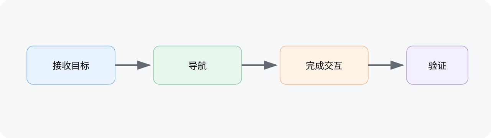

# 星港原型范围评审会

会议时间：2026-07-15 14:00–14:35

参与人：林青、陈岚

录音时长：35 分钟

> 本纪要根据会议转录生成，关键结论与待办已建立原文证据映射。

## 总结

团队确认本轮只验证导航与交互闭环，内容扩展留到下一阶段。首轮验证完成后，再根据数据决定是否扩大范围。

## 关键结论

### 当前范围

本轮原型只覆盖从接收目标到完成一次交互的核心闭环，不加入长期成长系统。

### 验证顺序

先验证流程稳定性，再检查表现层质量；两项使用不同验收指标。

## 待办

- [ ] 林青：7 月 18 日前提交核心闭环验收清单；依赖：交互接口说明；验收：清单覆盖正常路径与异常路径。
- [ ] 陈岚：负责人待确认后整理表现层评价维度；期限：待确认；验收：形成可执行的评价表。

## 智能章节

### 00:00 当前阶段目标

讨论本轮原型的验证目的，确认范围不扩展到长期成长。

### 12:40 验证顺序与责任

确认先检查流程稳定性，再评价表现层，并分配首项清单负责人。

### 27:15 后续范围

下一阶段内容只记录为候选，待本轮数据出来后再决定。

## 关键决策

- 本轮只验证导航与交互闭环。
- 流程稳定性与表现层质量分开验收。

## 金句时刻

> “先证明闭环稳定，再讨论怎么扩。”

— 林青，05:22

## 相关链接

- 核心流程图：visuals/core-flow.svg

## 完整转录

### 00:00 当前阶段目标

00:00 林青：这轮先把导航到交互完成的闭环跑通。

05:22 林青：先证明闭环稳定，再讨论怎么扩。

12:40 陈岚：流程稳定和表现好不好应该分开看。

18:05 林青：我在 18 号前把验收清单给出来。

27:15 陈岚：长期成长可以放到下一轮，先不定。
